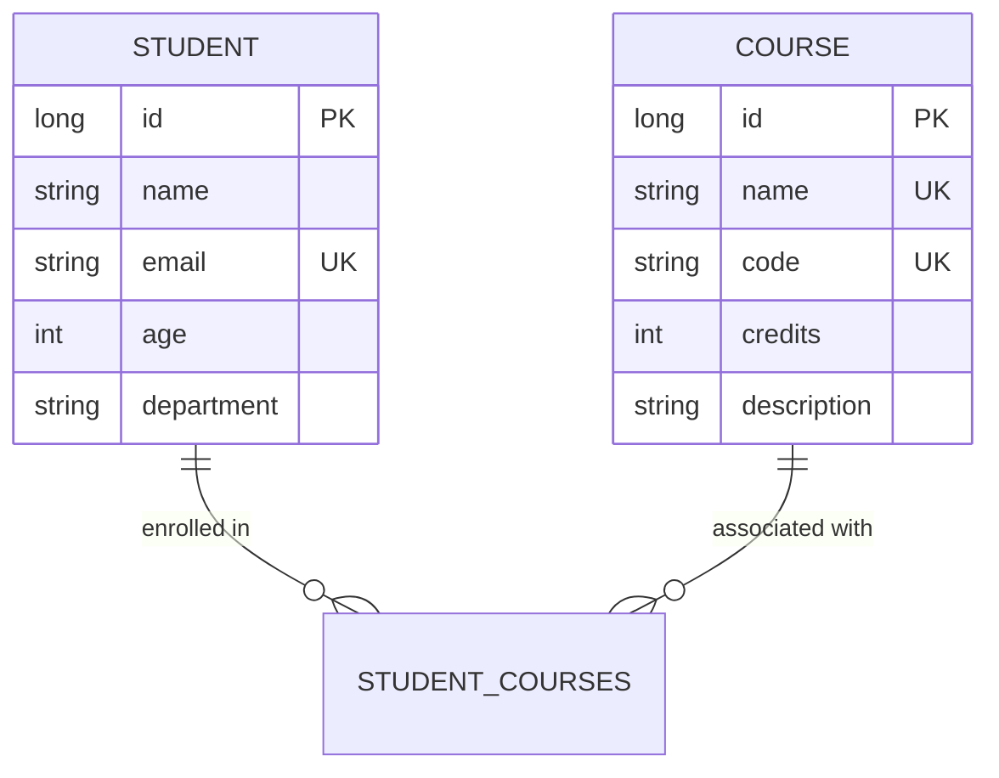

# Student Course Management System

This project provides a professional application for managing academic records, specifically handling the relationships between students and their enrolled courses. It implements a robust many-to-many data model and is containerized to ensure consistent deployment across different environments.

## Project Description

The application is built using the Spring Boot framework and manages two primary entities: Students and Courses. A student can enroll in multiple courses, and each course can host multiple students. The system ensures data integrity through validation constraints and unique identifiers for emails and course codes.

## Database Schema and ER Diagram

The persistence layer is managed by MySQL. The relationship between students and courses is implemented using a join table named `student_courses` to maintain referential integrity.



### Table Definitions

1.  **Students**: Stores personal details including age, department, and a unique email address.
2.  **Courses**: Stores academic course information including a unique course code and credit value.
3.  **Student_Courses**: A junction table that links Student IDs to Course IDs.

## Technology Stack

*   **Backend**: Spring Boot 3.2.5, Java 17
*   **Data Access**: Spring Data JPA (Hibernate)
*   **Database**: MySQL 8.0
*   **Web Layer**: Spring MVC with JSP templates
*   **Containerization**: Docker and Docker Compose

## Installation and Setup

### Prerequisites

Ensure the following tools are installed on your system:
*   Docker and the Docker Compose plugin
*   Java Development Kit (JDK) 17 (optional, for local builds)
*   Maven 3.8 or higher (optional, for local builds)

### Automated Setup (Docker Compose)

The most reliable way to run the application is through Docker Compose, which handles the database configuration and application networking automatically.

1.  Open a terminal in the project root directory.
2.  Execute the build and startup command:
    ```bash
    docker compose up --build
    ```
3.  The application will be accessible at: `http://localhost:8080`
4.  The MySQL database is mapped to port `3307` on the host machine for external inspection.

### Manual Local Setup

1.  Create a MySQL database named `student_course_db`.
2.  Configure your database credentials in `src/main/resources/application.properties`.
3.  Execute the application using the Maven wrapper:
    ```bash
    ./mvnw spring-boot:run
    ```

## Development and Testing

Unit and integration tests are located in `src/test`. These tests utilize an H2 in-memory database to verify repository logic and service layer transactions without requiring a live MySQL instance.

To execute the test suite, run:
```bash
./mvnw test
```
